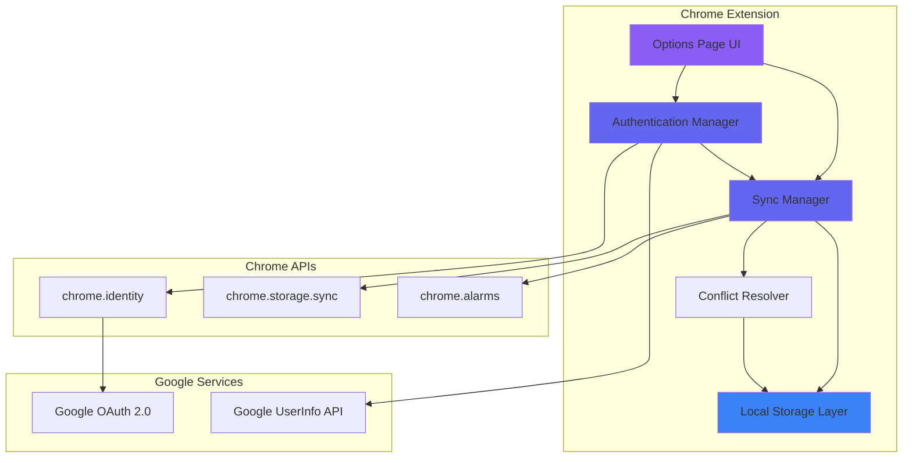
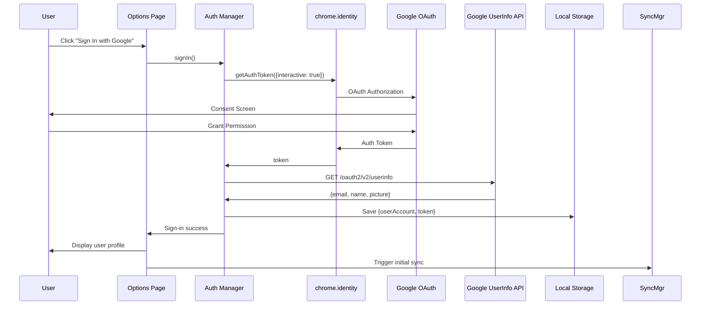
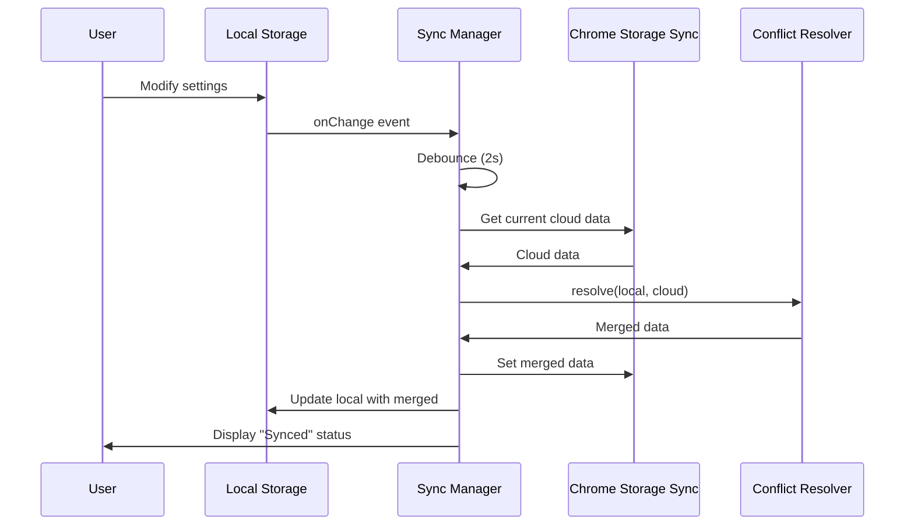
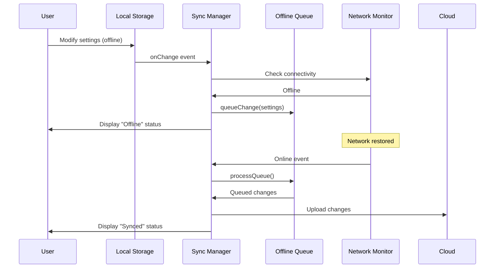

# Design Document: Google Account Integration

## Overview

### Purpose

This document details the technical design for integrating Google Account authentication and cloud synchronization into the Spoiler Blocker Chrome extension (v1.2.0). The feature enables users to optionally sign in with their Google Account to sync settings, watched items, and keyword lists across multiple devices while maintaining the extension's core privacy-first design and offline functionality.

### Goals

1. **Optional Authentication**: Implement Google OAuth 2.0 authentication using Chrome Identity API without requiring sign-in for core functionality
2. **Cloud Synchronization**: Enable automatic and manual synchronization of user preferences and data across devices
3. **Offline-First Operation**: Ensure the extension functions fully when offline with queued sync on reconnection
4. **Seamless Migration**: Provide a smooth path for existing users to migrate local data to cloud storage
5. **Privacy Preservation**: Maintain strict privacy guarantees by never transmitting URLs, page content, or browsing history
6. **Foundation for Premium**: Create infrastructure to support future premium tier validation

### Non-Goals

- This design does NOT include implementation of premium features (only the infrastructure to support them)
- This design does NOT include social features or sharing capabilities
- This design does NOT include analytics or usage tracking beyond sync status
- This design does NOT replace local storage (cloud is supplementary, not primary)

### Key Design Decisions

**Decision 1: Chrome Identity API over Custom OAuth**
- **Rationale**: Chrome's built-in `chrome.identity` API handles OAuth flows securely, manages token lifecycle, and provides silent refresh capabilities
- **Tradeoff**: Limited to Chrome's supported OAuth providers, but Google is our only target provider
- **Alternative Considered**: Custom OAuth implementation would give more control but requires managing security, token storage, and refresh logic

**Decision 2: Cloud Storage Backend - Chrome Storage Sync as Primary**
- **Rationale**: Chrome's built-in `chrome.storage.sync` API provides per-user data isolation, automatic sync across signed-in Chrome browsers, and quota management
- **Tradeoff**: Limited to Chrome ecosystem and 100KB quota limit, but sufficient for our data size
- **Alternative Considered**: Third-party backend (Firebase, Supabase) would provide more storage but adds complexity, cost, and privacy concerns

**Decision 3: Last-Write-Wins Conflict Resolution**
- **Rationale**: Simple, predictable, and sufficient for single-user multi-device scenarios where concurrent edits are rare
- **Tradeoff**: Risk of data loss if user makes conflicting changes on multiple devices simultaneously
- **Alternative Considered**: Operational Transform or CRDT would handle concurrent edits better but adds significant complexity

**Decision 4: Union Merge for Lists (Watched Items, Keywords)**
- **Rationale**: Users expect additions on one device to appear on all devices; deletions are rarer and less critical
- **Tradeoff**: Deleted items may reappear if deletion hasn't synced before a union merge
- **Alternative Considered**: Tombstone-based deletion tracking would be more robust but increases data size and complexity

**Decision 5: Exponential Backoff for Sync Retries**
- **Rationale**: Standard practice for network operations; respects rate limits and reduces server load
- **Tradeoff**: User may experience delays in sync during network issues
- **Alternative Considered**: Fixed retry intervals would be simpler but could trigger rate limits

## Architecture

### System Architecture Diagram



### Component Overview

#### 1. Authentication Manager (`auth-manager.js`)

**Responsibilities:**
- Initiate OAuth flow using `chrome.identity.getAuthToken()`
- Fetch user profile information from Google UserInfo API
- Manage auth token lifecycle (storage, refresh, revocation)
- Handle authentication errors and fallbacks
- Maintain sign-in/sign-out state

**Key Methods:**
- `signIn()`: Initiates interactive OAuth flow
- `signOut()`: Revokes token and clears user data
- `refreshToken()`: Silently refreshes expired token
- `getUserProfile()`: Fetches name, email, picture from Google API
- `isSignedIn()`: Returns current authentication state

#### 2. Sync Manager (`sync-manager.js`)

**Responsibilities:**
- Orchestrate bidirectional sync between local and cloud storage
- Queue changes when offline and process on reconnection
- Implement debouncing for frequent changes (2-second window)
- Schedule periodic background syncs (30-minute intervals)
- Track sync status and emit status events

**Key Methods:**
- `syncNow()`: Trigger immediate full sync
- `queueChange(changeType, data)`: Add change to offline queue
- `processQueue()`: Upload queued changes when online
- `onStorageChange(listener)`: Subscribe to sync status updates
- `getSyncStatus()`: Returns current sync state (synced, syncing, offline, error)
- `getLastSyncTime()`: Returns timestamp of last successful sync

#### 3. Conflict Resolver (`conflict-resolver.js`)

**Responsibilities:**
- Implement last-write-wins strategy for settings
- Perform union merge for watched items and keywords
- Handle per-phrase RL weight conflicts by timestamp
- Log conflict resolution decisions for debugging

**Key Methods:**
- `resolveSettings(local, cloud)`: Merge settings with LWW
- `resolveWatchedItems(local, cloud)`: Union merge by item ID
- `resolveKeywords(local, cloud)`: Union merge by keyword string
- `resolveRLWeights(local, cloud)`: Per-phrase LWW by timestamp

#### 4. Migration Handler (`migration-handler.js`)

**Responsibilities:**
- Detect first-time sign-in for existing users
- Upload all local data to cloud storage
- Display progress indicator during migration
- Mark account as migrated in metadata
- Handle migration failures gracefully

**Key Methods:**
- `needsMigration()`: Check if user has local data and no cloud data
- `performMigration()`: Upload all local data to cloud
- `getMigrationProgress()`: Return progress percentage
- `rollbackMigration()`: Restore state on failure

#### 5. Local Storage Layer (`storage-wrapper.js`)

**Responsibilities:**
- Provide unified interface for local storage access
- Abstract Chrome storage API details
- Emit change events for sync manager
- Handle storage quota errors

**Key Methods:**
- `get(keys)`: Retrieve data from local storage
- `set(data)`: Store data to local storage and trigger sync
- `remove(keys)`: Delete data from local storage
- `onChange(listener)`: Subscribe to storage change events

### Data Flow Diagrams

#### Sign-In Flow



#### Sync Flow (Online)



#### Offline Queue Flow



## Components and Interfaces

### Authentication Manager Interface

```javascript
/**
 * Manages Google Account authentication and user profile
 */
class AuthenticationManager {
  /**
   * Initiates interactive sign-in flow
   * @returns {Promise<UserProfile>} User profile data
   * @throws {AuthError} If sign-in fails
   */
  async signIn() {}

  /**
   * Signs out and revokes tokens
   * @returns {Promise<void>}
   */
  async signOut() {}

  /**
   * Silently refreshes expired token
   * @returns {Promise<string>} New auth token
   * @throws {AuthError} If refresh fails
   */
  async refreshToken() {}

  /**
   * Fetches user profile from Google API
   * @param {string} token - Auth token
   * @returns {Promise<UserProfile>} User profile
   */
  async getUserProfile(token) {}

  /**
   * Checks if user is currently signed in
   * @returns {Promise<boolean>}
   */
  async isSignedIn() {}

  /**
   * Gets cached user profile
   * @returns {Promise<UserProfile|null>}
   */
  async getCachedProfile() {}
}
```

### Sync Manager Interface

```javascript
/**
 * Orchestrates data synchronization between local and cloud storage
 */
class SyncManager {
  /**
   * Triggers immediate full sync
   * @returns {Promise<SyncResult>}
   */
  async syncNow() {}

  /**
   * Queues a change for later sync when offline
   * @param {ChangeType} type - Type of change
   * @param {any} data - Change data
   */
  queueChange(type, data) {}

  /**
   * Processes queued changes
   * @returns {Promise<number>} Number of changes processed
   */
  async processQueue() {}

  /**
   * Subscribes to sync status updates
   * @param {Function} listener - Callback for status changes
   * @returns {Function} Unsubscribe function
   */
  onStatusChange(listener) {}

  /**
   * Gets current sync status
   * @returns {SyncStatus}
   */
  getSyncStatus() {}

  /**
   * Gets timestamp of last successful sync
   * @returns {number|null}
   */
  getLastSyncTime() {}

  /**
   * Starts periodic background sync
   * @param {number} intervalMinutes - Sync interval
   */
  startPeriodicSync(intervalMinutes) {}

  /**
   * Stops periodic background sync
   */
  stopPeriodicSync() {}
}
```

### Conflict Resolver Interface

```javascript
/**
 * Resolves conflicts between local and cloud data
 */
class ConflictResolver {
  /**
   * Resolves settings conflicts using last-write-wins
   * @param {Settings} local - Local settings
   * @param {Settings} cloud - Cloud settings
   * @returns {Settings} Merged settings
   */
  resolveSettings(local, cloud) {}

  /**
   * Merges watched items using union strategy
   * @param {WatchedItem[]} local - Local items
   * @param {WatchedItem[]} cloud - Cloud items
   * @returns {WatchedItem[]} Merged items
   */
  resolveWatchedItems(local, cloud) {}

  /**
   * Merges keywords using union strategy
   * @param {string[]} local - Local keywords
   * @param {string[]} cloud - Cloud keywords
   * @returns {string[]} Merged keywords
   */
  resolveKeywords(local, cloud) {}

  /**
   * Resolves RL weights using per-phrase last-write-wins
   * @param {Object<string,WeightData>} local - Local weights
   * @param {Object<string,WeightData>} cloud - Cloud weights
   * @returns {Object<string,WeightData>} Merged weights
   */
  resolveRLWeights(local, cloud) {}
}
```

### UI Components

#### Account Section (Options Page)

```javascript
/**
 * Renders account management UI in options page
 */
class AccountSection {
  /**
   * Renders sign-in button when not authenticated
   */
  renderSignInButton() {}
