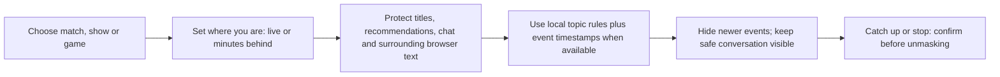

# Live streaming flow, product priorities and pricing

Product proposal, September 19, 2026. Suggested prices are hypotheses to validate with users, not competitor prices or a revenue forecast. No payment processor or real-time media analysis is enabled by this change.

## Live TV / streaming protection flow

Start with a **second-screen/event mode**, where the user selects teams, players, a game or episode, and a time window. Default to Strict topic protection during the event. Hide result-bearing browser cards, chat messages and recommendation titles; preserve the actual player so the user can keep watching. Add a prominent “I'm caught up” action, a delay slider, and a clear expiration/extend prompt. Never automatically reveal at a predicted end time if the user may be behind.

Phase two adds tested adapters for YouTube live chat and supported streaming-page DOM, with keyword scores separated from event time. Timestamp provenance matters: a reposted old goal or a delayed chat message must not be assumed current. If event time is unknown, conceal conservatively and explain why. Measure wrong hides, missed spoilers and processing latency on consented fixtures.

Audio, subtitles and video pixels are a separate engineering project. Start with available text tracks only after the user opts in. A transcription/OCR path requires an explicit capture action and visible stop controls; [Chrome tabCapture](https://developer.chrome.com/docs/extensions/reference/api/tabCapture) starts from a user-invoked active tab. Buffering delay would need to exceed transcription/classification latency, with a measurable safety margin, before muting/concealing could happen ahead of the user's playback. Protected streams may not expose usable content. Do not promise DRM bypass or native-game coverage, and do not imply browser text matching already provides media analysis.

The currently implemented features protect **browser text and metadata** about games, shows and events. They do not change native games, analyze streamed pixels/audio, or track episode completion.

## Prioritized improvements

1. **Progress-aware topics:** watched episode/chapter/game milestone, with versioned metadata and spoiler-safe setting labels.
2. **Temporary event mode:** one-click Strict protection, team/driver presets, session timer and explicit catch-up confirmation.
3. **Site adapter regression fixtures:** live-chat virtualization, SPA navigation, feed recycling, accessible controls and supported open shadow roots.
4. **Signed keyword pack updates:** provenance, schema/size limits, rollback and explicit user selection. Never silently replace a user's vocabulary.
5. **Optional account hardening:** managed recovery, email verification, administrator MFA, session/device management and encrypted backups.
6. **Measured quality:** publish precision/recall by site/language on a spoiler-safe evaluation dataset. Avoid unsupported “100% spoiler-proof” claims.

## Suggested launch pricing

| Tier | Requested keyword quota | Suggested monthly | Suggested annual |
|---|---:|---:|---:|
| Free | 2 literal entries | €0 | €0 |
| Premium | 10 literal entries | €2.99 | €24.99 |
| Max | No tier quota | €5.99 | €49.99 |

Keep concealment styles, privacy, accessibility, manual title packs and YouTube controls available on Free. The current implementation permits optional settings backup on all account tiers; Premium/Max add keyword capacity. Device safety capacity still applies. Since title packs and aliases do not count toward keyword limits, validate that users actually find extra literal rules valuable before relying on this pricing difference.

Users already have capable alternatives such as [BlockTube](https://github.com/amitbl/blocktube) and [Spoiler Slayer](https://brettp.github.io/spoiler-slayer/). Stronger paid value would come from reliable progress-aware protection, curated live-event packs and proven cross-device workflows. Test monthly willingness to pay with a small beta; if retention is weak, consider an annual-only plan or a modest one-time local-only edition. Avoid promising lifetime hosted services before measuring ongoing costs. Price any future cloud transcription separately or with a clear minute allowance.

## Billing implementation when you publish

Use hosted checkout and a customer portal. [Chrome Web Store payments were deprecated](https://developer.chrome.com/docs/webstore/cws-payments-deprecation/), so do not build around store-managed subscriptions. A provider such as [Stripe Billing Entitlements](https://docs.stripe.com/billing/entitlements) can drive server-side plan changes. Verify webhook signatures, process events idempotently, and reconcile cancellations, refunds, grace periods and failed payments. Never grant Premium from a browser's checkout-success URL or an imported settings field.

Keep administrative plan assignment as a separate, auditable operation. Before accepting money, add immutable entitlement-change audit records, verified recovery, administrator MFA, a refund/cancellation flow and the operator's disclosures. Review the [Chrome Web Store user-data policy](https://developer.chrome.com/docs/webstore/user_data) against the optional account feature and any future capture/transcription feature. The current website labels prices as proposed and has no fake purchase buttons.
